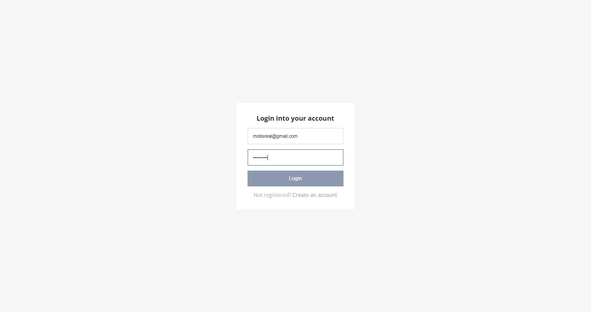
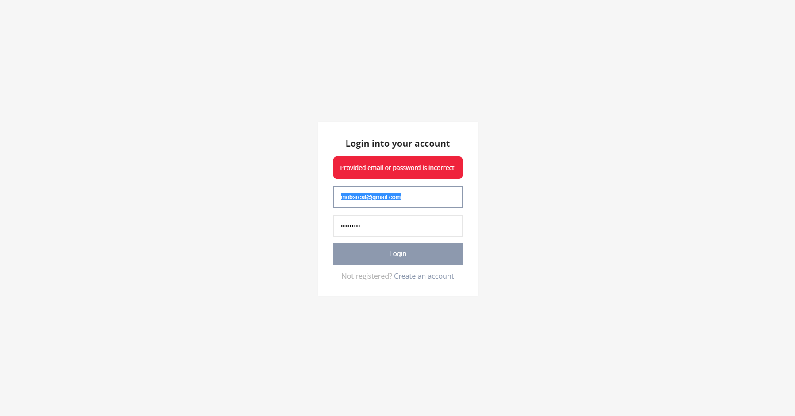
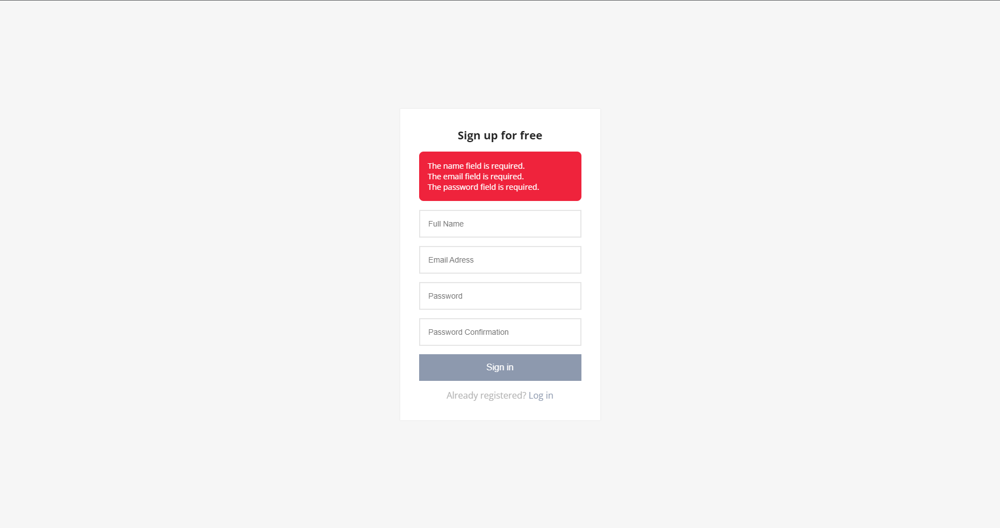
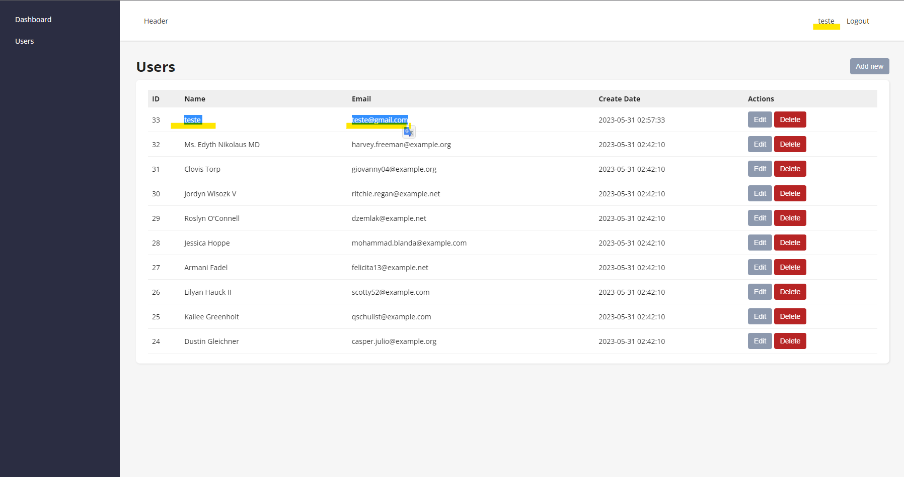

# Fullstack Login Component

A component capable of handling backend and front end information, using laravel and vite.
The project was adapted to handle errors such bad requests to the laravel API and also providing enough space to run the tests when needed.
Both Front-end and Back-end uses mosntly Php, but for the visual aspect of the pages it's used vite/react.

pt-br:
Um componente capaz de lidar com informações de back-end e front-end, usando laravel e vite.
O projeto foi adaptado para tratar erros como requisições ruins para a API do laravel e também disponibilizando espaço suficiente para rodar os testes quando necessário. 
Ambos Front-end e Back-end usam principalmente Php, mas para o aspecto visual das páginas é usado vite/react.
